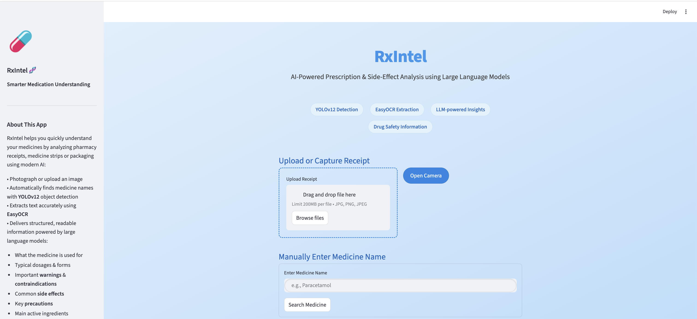
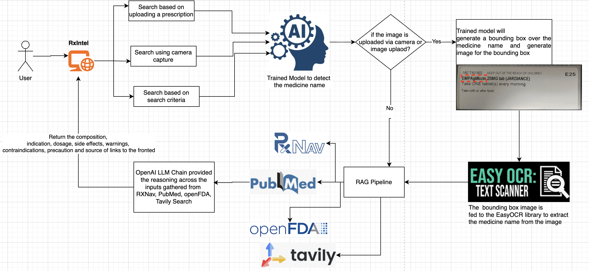
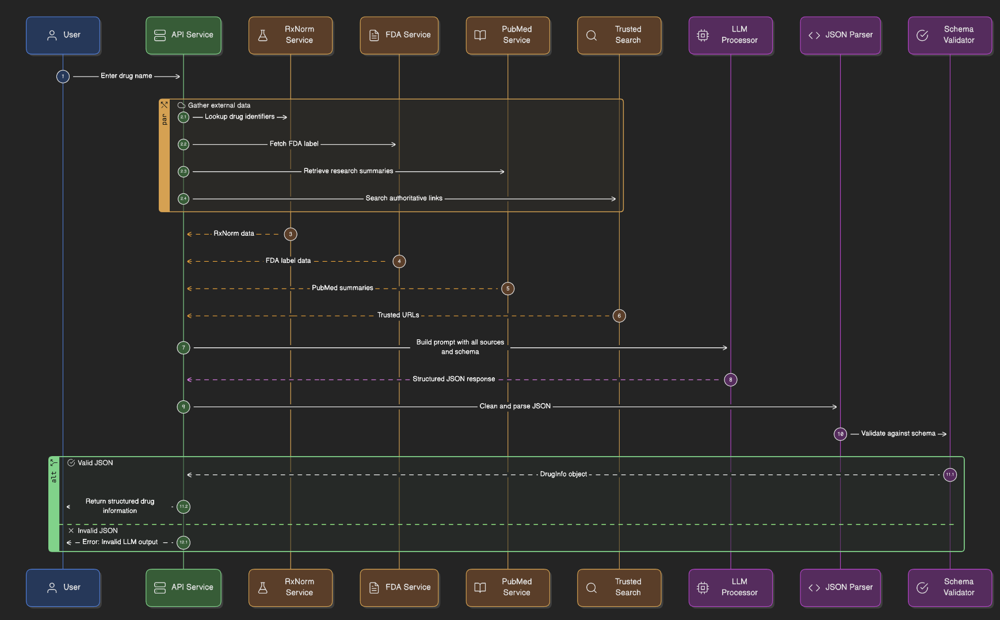
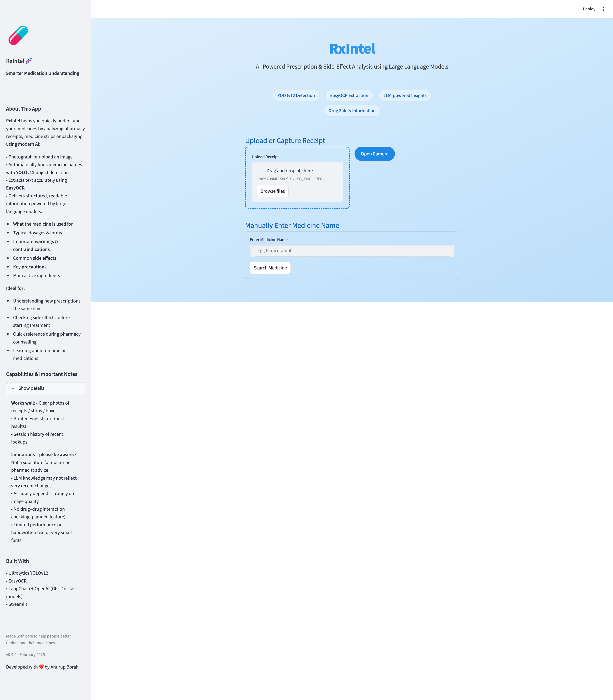

# RxIntel Multimodal AI - AI-Powered Prescription & Side-Effect Analysis using Large Language Models

End-to-end multimodal AI for prescription understanding and medication side-effect analysis using Vision, OCR, and Biomedical LLMs.

RxIntel Multimodal AI is an end-to-end healthcare-focused intelligent system for prescription understanding and medication insight extraction, combining computer vision, OCR, and large language models (LLMs). The project detects and parses prescription labels, extracts structured medication information, and leverages biomedical LLMs to generate clinically relevant insights such as drug usage, side effects, and safety considerations.

The system is designed to handle noisy real-world prescription data and demonstrates a multimodal pipeline that bridges image-based medical documents with natural language reasoning, making it suitable for healthcare analytics, clinical decision support, and medical AI research.

The model is trained on medical prescription provided by Singapore clinics and using Roboflow to `split the dataset` to train, test and validation sets, apply `pre-processing` to the images(resize, greyscale and auto-orient), `augmentation` of the images(rotate, shear, brightness, blur, noise).

NB: Please note that the model will extract the medicine names for prescription provided by Singapore clinics. The model is trained on around 200 datasets, if its trained on more datasets the model will perform perfect.

## ✨ Key Features

📸 Vision-based prescription and label detection

🧾 OCR-driven text extraction from real-world medical documents

🧠 LLM-powered medication understanding and side-effect analysis

🔗 Structured data extraction for downstream healthcare applications

🏥 Built with a focus on robustness, scalability, and clinical relevance

📷 Prescription & label detection using deep learning–based vision models

🔤 Medical OCR & text normalization for noisy and low-quality prescription images

💊 Medication entity extraction

- Drug name
- Dosage
- Warnings
- Precautions
- Sources

🧠 LLM-powered reasoning

 - Side effects
 - Contraindications
 - Usage guidance

🧩 Multimodal pipeline integrating visual, textual, and semantic signals

📦 Structured outputs (JSON) for downstream clinical or analytics systems

### 🧠 How It Works

`get_medicine_info` is the core orchestration method that gathers authoritative drug data from multiple trusted sources and uses a Large Language Model (LLM) to produce a single, structured medical summary.

1. Multi-source data collection

Given a drug name, the system first retrieves raw information from several reliable sources:

RxNav – standardized drug names, identifiers, and formulations

OpenFDA – official FDA drug labels and safety information

PubMed – research paper summaries and biomedical evidence

Tavily Search – top authoritative web links (FDA, NIH, NHS, etc.)

Each source contributes a different perspective (regulatory, clinical, research, and public health).

2. Controlled LLM prompt construction

All collected data is injected into a carefully designed prompt that:

Instructs the LLM to summarize only trustworthy medical information

Prioritizes sources like FDA, NIH, NHS, and PubMed

Explicitly forbids personalized medical advice

Requires output to match a strict JSON schema (DrugInfo)

This ensures consistency, safety, and machine-readable output.

3. LLM-based synthesis and normalization

The LLM (via an LLMChain) performs reasoning across all inputs to:

Reconcile overlapping or conflicting information

Omit unknown or unsupported fields

Normalize terminology and structure

Generate a single, coherent JSON response

The model acts as a medical information synthesizer

4. JSON validation and schema enforcement

The LLM output is then:

Cleaned of any markdown or formatting artifacts

Parsed as JSON

Validated against the DrugInfo schema

## Architecture Diagram

The following diagrams illustrate how RxIntel Multimodal AI aggregates trusted medical data and uses an LLM to produce validated, schema-safe drug intelligence.

## Sequence Diagram

This design makes **RxIntel Multimodal AI** reliable, auditable, and production-ready for medical knowledge applications.

## Appendix

## RxIntel Multimodal main page

### Medicine Prescription Upload Search

### Medicine Name Test Search

